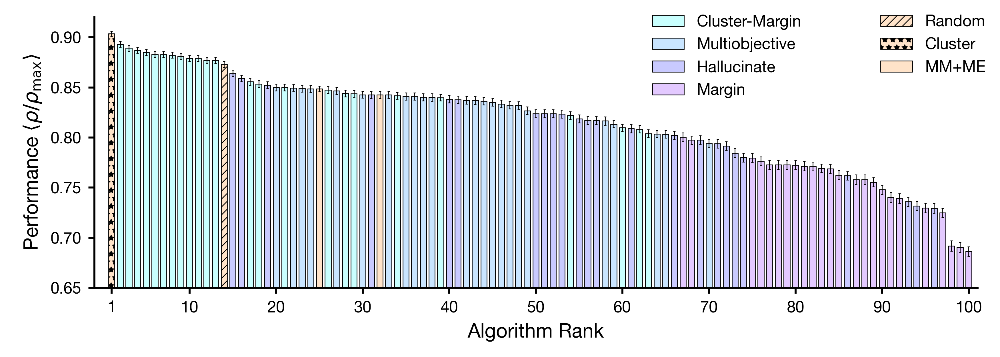

# data-efficient-regression
This repository includes the code and data used to generate the results in "Minimizing Data Requirements for Material Property Prediction _via_ Cluster-based Training Set Selection" by Q.M. Gallagher, S. Hasko, and M.A. Webb. We provide a walk-through of how to generate the results in each section of the manuscript using the code included here.



### Setup
Please set up the appropriate environment by running:
```
pip install -r requirements.txt
```

### Survey of Training Data Selection Algorithms

All code needed to recreate the results of the initial survey is present in the ``survey/`` directory. ``gen_dataset.py`` is used to generate training sets using different algorithms, while ``evaluate_datasets.py`` trains ML models and records their accuracy. Surrogate models are implemented in the ``models/`` directory, batch selection algorithms are implemented in ``batch_selection.py``, and space-filling algorithms are implemented in ``samplers.py.``

We record the training sets generated by our survey in the ``survey-datasets/`` directory, stored in this repo as a .zip file that must be unpacked prior to analysis. The results following model evaluation are stored in the ``survey-results`` directory. Figure 2 can be generated by using the ``survey_results.ipynb`` notebook.

### Correlation between Cluster Metrics and Selection Quality

To regenerate the results in Figure 3, ``metric/compute_metrics.py`` should be applied to ``survey/survey-datasets/size_100`` to generate ``metrics_100.csv``. The outcome of this analysis is present in the repository. Figure 3 itself can be regenerated by following the ``metric.ipynb`` notebook. Modifications to this workflow can be used to generate similar results for datasets of size 50 and 200, in addition to the analysis of other metrics that were not included in the final manuscript.

### Analysis of High-dimensional Feature Spaces

To regenerate the results in Figures 4 and 5, one can follow the same procedure as the previous two sections with small modifications. ``survey/gen_dataset.py`` and ``survey/evaluate_datasets.py`` can be used to generate and evaluate training sets, but they should be run with the ``--full`` flag to ensure that the high-dimensional datasets, rather than the subsampled ones, are loaded (in addition to small algorithmic changes). We store the results of this analysis in ``survey/survey-datasets/size_100_high_d.zip`` and ``survey/survey-results/results_100_full.csv``. Figure 4A can be regenerated by running ``analysis/survey_high_d.ipynb``.

To recreate Figure 4B, dataset metrics can be computed using ``compute_metrics_high_d.py`` (the output of which is stored as ``metric_100_high_d.csv``) and the notebook ``metric_high_d.ipynb`` can be run. To generate Figure 5, one can run ``metric_high_d_3d.py``. 

### Analysis of Learned Representations

To survey approaches to training set selection for learned representations, training sets can be created and evaluated using the ``graphs/gen_data.py`` file, which uses the GNN implementation based on ``graphs/gnn.py`` and ``graphs/utils.py``. Datasets generated for molecular property prediction tasks are present in ``graphs/datasets.zip`` and model results are present in ``graphs/results.csv``. One can compute training set metrics using ``graphs/metric.py``, resulting in ``graphs/metric.csv``. 

The subplots in Figure 6 can be recreated by running ``analysis/graph.ipynb``. 

### Impact of Training Set Size on Selection Algorithm Quality

To assess the impact of training set size on selection algorithm quality, you can run ``size/gen_datasets.py`` to generate datasets that can be evaluated by ``size/evaluate.py``, which stores results in ``size/results.csv``. This analysis relies on the batch selection strategies in ``size/batch_selection.py`` and the models in ``size/models/``. The datasets generated by this analysis are available in ``size/datasets``. The databases themselves are stored in ``size/databases``. They were prepared using the process outlined in SI Section S7.

The results of this analysis is stored in ``size/results.csv``, and Figure 7 can be recreated by running ``analysis/size.ipynb``.
